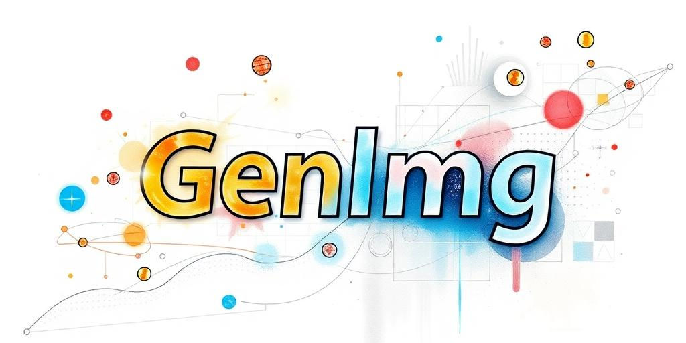

    

<h1 align="center"><code>GenImg - Your Gateway to AI-Powered Digital Creativity</code></h1>

    <em><code>Transforming your imagination into stunning visuals with the power of AI.</code></em>

    
    
    
    
    

---

## 🚀 Application Showcase

Immerse yourself in the world of AI-generated images! Below are some snapshots of the app's stunning interface and capabilities:

---

## 🎨 Overview

**GenImg** is a groundbreaking web application that harnesses the power of cutting-edge artificial intelligence to create stunning images based on your _imagination_. Whether you're an artist experimenting with novel ideas, a marketer crafting visual content, or just someone exploring the frontiers of digital creativity, **GenImg** is here to revolutionize your visual workflow.

Designed with an impeccable user interface and packed with a variety of unique features, **GenImg** offers a seamless and immersive user experience across both desktop and mobile devices.

---

## ✨ Features

#### **💡 Intelligent Image Generation:**

Unleash your creativity with our state-of-the-art AI models. Simply enter a _prompt_ describing the image you want, and watch as **GenImg** brings your imagination to life in seconds!

#### **⚙️ Fully Configurable Settings:**

From inputting customizable prompts to fine-tuning dimensions, you have complete control over the generated artwork. Configure:

- Image width and height (64px to 1440px).
- **Aspect Ratio Lock** functionality for consistent proportional resizing.
- **Negative Prompts**—exclude unwanted elements from the result.

#### **📱 Cross-Platform Elegance:**

Our **Dual-Interface Design** guarantees a premium user experience:

- **Desktop View**: Explore a professional interface with high-definition previews and in-depth configurations.
- **Mobile View**: Enjoy a touchscreen-optimized UX featuring swipe gestures, lightbox modals, and smooth aspect ratio adjustments on smaller displays.

#### **💾 Persistent Photo Album:**

Never lose a masterpiece! GenImg stores your creation history and allows you to browse, save, or delete your creations with just a few effortless taps or clicks.

#### **🖼️ Photo Album & Lightbox Modes:**

View your AI-generated masterpieces in our beautifully-designed photo album. Select images for fullscreen display or access additional details (e.g., creation time, dimensions, input prompts).

#### **📂 Quick Save or Integration:**

Download image results to continue your creative journey! All images are locally stored using efficient caching for instant offline browsing.

#### **⚡ Instant Config Cloning:**

Minimal setup—maximum creativity! Quickly copy settings from previous images, allowing you to iterate on styles seamlessly.

#### **🖌️ Elegant & Intuitive Controls:**

With its **slider-based resizing**, **one-tap configuration swapping**, and responsive behaviors, GenImg ensures even complex controls feel light and intuitive.

#### **📏 Predefined Ratios & Dimension Swapping:**

Easily switch between popular aspect ratios—like _16:9, 4:3,_ or _1:1_—or toggle vertical/horizontal layouts with one click.

---

## 🌟 User Interface Highlights

### **📷 Desktop Modal:**

- A sleek fullscreen modal for showcasing generated results.
- Displays image prompts, dimensions, and metadata.
- One-click copy of settings for tweaking creations.

### **📱 Mobile-Friendly Modal:**

- Gesture-driven scrolling and multitouch compatibility.
- Interactive lightbox for fullscreen previews.
- Adaptive scrolling mechanics to optimize vertical space.

### **🖼️ Album View:**

- Grid-based gallery with flexible row height.
- Easy hover menus to **Download**, **Delete**, or open images.

### **⚙️ Advanced Configuration:**

- Adjust sliders for image width and height dynamically.
- Toggle _Aspect Ratio Lock_ for proportional control.
- Integrated popstate events for seamless navigation.

---

## 🌐 Tech Stack

GenImg is built with modern web technologies to ensure efficiency, responsiveness, and style:

- **Next.js**: For blazing-fast rendering and server-side generation capabilities.
- **React**: To create interactive UIs with reusable components.
- **TailwindCSS**: For beautifully responsive and minimalist designs.
- **TogetherAI API**: Powering the AI backend with image generation.
- **Typescript**: Ensuring type safety and code reliability.

---

## 🎯 Project Roadmap

- [x] **Responsive Across Platforms:** Fully functional on **desktop & mobile** devices.
- [x] **Advanced Prompt Controls:** Fine-tune with **negative prompts** + adjustable sizes.
- [ ] **Social Media Integration:** Sharing on popular platforms.

---

## 🤝 Contributing

Interested in shaping the future of AI-based image-generation tools? **We welcome contributions!**

- ⭐ Fork this repository
- 📩 Submit Pull Requests
- 🐛 Report issues for new enhancement ideas

---

## 🛡️ License

This project is licensed under the [MIT License](https://choosealicense.com/licenses/mit/).

---

## 🙌 Acknowledgments

Thanks to all the contributors, AI researchers, and open-source enthusiasts who made this platform possible!
